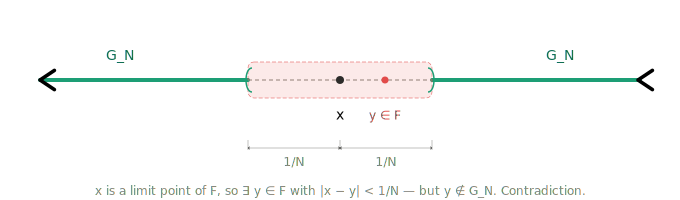

# Exercises 2A — Outer Measure on $\mathbb{R}$

**Source:** Axler, *Measure, Integration & Real Analysis* (MIRA), Section 2A, pp. 23–24.

---

## Exercise 1

> Prove that if $A$ and $B$ are subsets of $\mathbb{R}$ and $|B| = 0$, then $|A \cup B| = |A|$.

**Proof.**

We show both inequalities.

**(i)** $|A \cup B| \leq |A|$:

Since $|B| = 0$, for every $\varepsilon > 0$ there exists a sequence of open intervals $\{I_k\}_{k=1}^{\infty}$ with $B \subseteq \bigcup_{k=1}^{\infty} I_k$ such that

$$\sum_{k=1}^{\infty} \ell(I_k) < \varepsilon.$$

Now let $\{G_i\}_{i=1}^{\infty}$ be any sequence of open intervals that covers $A$, i.e. $A \subseteq \bigcup_{i=1}^{\infty} G_i$. Then

$$A \cup B \subseteq \left(\bigcup_{i=1}^{\infty} G_i\right) \cup \left(\bigcup_{k=1}^{\infty} I_k\right),$$

so by the definition of outer measure (MIRA, Definition 2.2),

$$|A \cup B| \leq \sum_{i=1}^{\infty} \ell(G_i) + \varepsilon.$$

Taking the infimum over all such covers $\{G_i\}$ of $A$, we obtain

$$|A \cup B| \leq |A| + \varepsilon.$$

Since $\varepsilon > 0$ was arbitrary, we conclude $|A \cup B| \leq |A|$.

**(ii)** $|A| \leq |A \cup B|$:

Since $A \subseteq A \cup B$, this follows immediately from the order-preserving property of outer measure (MIRA, 2.5).

Combining (i) and (ii), we have $|A \cup B| = |A|$. $\blacksquare$

---

## Exercise 2

> Suppose $A \subseteq \mathbb{R}$ and $t \in \mathbb{R}$. Let $tA = \{ta : a \in A\}$. Prove that $|tA| = |t|\,|A|$.
> [Assume that $0 \cdot \infty$ is defined to be $0$.]

**Proof.**

If $t = 0$, then $tA = \{0\}$ (or $tA = \emptyset$ if $A = \emptyset$). In either case $|tA| = 0 = 0 \cdot |A| = |t|\,|A|$, using the convention $0 \cdot \infty = 0$.

Now assume $t \neq 0$. Let $\{I_k\}_{k=1}^{\infty}$ be any sequence of open intervals covering $A$, i.e. $A \subseteq \bigcup_{k=1}^{\infty} I_k$. Then

$$tA \subseteq \bigcup_{k=1}^{\infty} tI_k,$$

where each $tI_k$ is an open interval with $\ell(tI_k) = |t|\,\ell(I_k)$. Thus

$$|tA| \leq \sum_{k=1}^{\infty} \ell(tI_k) = |t| \sum_{k=1}^{\infty} \ell(I_k).$$

Taking the infimum over all such covers of $A$, we obtain

$$|tA| \leq |t|\,|A|.$$

For the reverse inequality, since $t \neq 0$ we can write $A = \frac{1}{t}(tA)$. Applying the inequality just proved with $\frac{1}{t}$ in place of $t$ and $tA$ in place of $A$, we get

$$|A| = \left|\frac{1}{t}(tA)\right| \leq \frac{1}{|t|}\,|tA|.$$

Multiplying both sides by $|t|$ gives $|t|\,|A| \leq |tA|$.

Combining both inequalities, $|tA| = |t|\,|A|$. $\blacksquare$

---

## Exercise 3

> Prove that if $A, B \subseteq \mathbb{R}$ and $|A| < \infty$, then $|B \setminus A| \geq |B| - |A|$.

**Proof.**

Note that $B \subseteq (B \setminus A) \cup A$, since every element of $B$ is either in $A$ or in $B \setminus A$. By the order-preserving property (MIRA, 2.5) and countable subadditivity of outer measure (MIRA, 2.8), we have

$$|B| \leq |(B \setminus A) \cup A| \leq |B \setminus A| + |A|.$$

Since $|A| < \infty$, we may subtract $|A|$ from both sides to obtain

$$|B \setminus A| \geq |B| - |A|. \quad \blacksquare$$

---

## Exercise 4

> Suppose $F$ is a subset of $\mathbb{R}$ with the property that every open cover of $F$ has a finite subcover. Prove that $F$ is closed and bounded.

**Key idea:** If a set is not closed, it is missing a limit point $x$. Build an open cover of $F$ that nibbles toward $x$ but never reaches it, so any finite subcover leaves out a ball around $x$ — contradicting the existence of points of $F$ arbitrarily close to $x$.

/// definition | Limit Point
    attrs: {id: def-limit_point}

A *limit point* of a set $F \subseteq \mathbb{R}$ is a point $x \in \mathbb{R}$ such that for every $\varepsilon > 0$, there exists $y \in F$ with $0 < |x - y| < \varepsilon$. A set is closed if and only if it contains all its limit points (Supplement for MIRA).
///

**Proof.**

**$F$ is closed:**

Suppose for contradiction that $F$ is not closed. Then there exists a limit point $x$ of $F$ with $x \notin F$. For each $n \in \mathbb{Z}^+$, define

$$G_n = \left\{y \in \mathbb{R} : |x - y| > \tfrac{1}{n}\right\}.$$

Each $G_n$ is open (it is the union of the two open rays $(-\infty, x - \tfrac{1}{n})$ and $(x + \tfrac{1}{n}, \infty)$). We claim $\{G_n\}_{n=1}^{\infty}$ is an open cover of $F$. Indeed, let $y \in F$. Since $x \notin F$, we have $y \neq x$, so $|x - y| > 0$. Choose $n$ large enough that $\tfrac{1}{n} < |x - y|$. Then $y \in G_n$. Hence

$$F \subseteq \bigcup_{n=1}^{\infty} G_n.$$

By hypothesis, there exists a finite subcover. Since $G_1 \subseteq G_2 \subseteq \cdots$, any finite subcollection $\{G_{n_1}, \ldots, G_{n_M}\}$ satisfies

$$\bigcup_{k=1}^{M} G_{n_k} = G_N, \quad \text{where } N = \max(n_1, \ldots, n_M).$$

So $F \subseteq G_N = \{y \in \mathbb{R} : |x - y| > \tfrac{1}{N}\}$. But $x$ is a limit point of $F$, so there exists $y \in F$ with $0 < |x - y| < \tfrac{1}{N}$, meaning $y \notin G_N$. This contradicts $F \subseteq G_N$. Therefore $F$ is closed.

**$F$ is bounded:**

The collection $\{(-k, k)\}_{k=1}^{\infty}$ is an open cover of $F$, since $F \subseteq \mathbb{R} = \bigcup_{k=1}^{\infty}(-k, k)$. By hypothesis, there exists a finite subcover. Since $(-1, 1) \subseteq (-2, 2) \subseteq \cdots$, the union of any finite subcollection equals the largest interval in that subcollection. Hence there exists $N \in \mathbb{Z}^+$ such that $F \subseteq (-N, N)$. Therefore $F$ is bounded. $\blacksquare$

---

## Exercise 5

> Suppose $\mathcal{A}$ is a set of closed subsets of $\mathbb{R}$ such that $\bigcap_{F \in \mathcal{A}} F = \emptyset$. Prove that if $\mathcal{A}$ contains at least one bounded set, then there exist $n \in \mathbb{Z}^+$ and $F_1, \ldots, F_n \in \mathcal{A}$ such that $F_1 \cap \cdots \cap F_n = \emptyset$.

**Proof.**

Since $\bigcap_{F \in \mathcal{A}} F = \emptyset$, taking complements gives

$$\mathbb{R} \setminus \bigcap_{F \in \mathcal{A}} F = \mathbb{R} \setminus \emptyset = \mathbb{R}.$$

By De Morgan's law, this becomes

$$\bigcup_{F \in \mathcal{A}} (\mathbb{R} \setminus F) = \mathbb{R}.$$

Since each $F \in \mathcal{A}$ is closed, each $\mathbb{R} \setminus F$ is open. Thus $\{\mathbb{R} \setminus F\}_{F \in \mathcal{A}}$ is a collection of open sets whose union is $\mathbb{R}$.

By hypothesis, there exists a bounded set $\hat{F} \in \mathcal{A}$. Since $\hat{F}$ is closed and bounded, the collection $\{\mathbb{R} \setminus F\}_{F \in \mathcal{A}}$ is an open cover of $\hat{F}$. By the Heine–Borel Theorem (MIRA, 2.12), there exists a finite subcover: there exist $F_1, \ldots, F_n \in \mathcal{A}$ such that

$$\hat{F} \subseteq \bigcup_{k=1}^{n} (\mathbb{R} \setminus F_k).$$

By De Morgan's law, $\bigcup_{k=1}^{n} (\mathbb{R} \setminus F_k) = \mathbb{R} \setminus \bigcap_{k=1}^{n} F_k$, so

$$\hat{F} \subseteq \mathbb{R} \setminus \bigcap_{k=1}^{n} F_k.$$

This implies $\hat{F} \cap \bigcap_{k=1}^{n} F_k = \emptyset$, i.e.

$$\hat{F} \cap F_1 \cap \cdots \cap F_n = \emptyset.$$

Since $\hat{F}, F_1, \ldots, F_n$ are all elements of $\mathcal{A}$, we have exhibited a finite subcollection of $\mathcal{A}$ whose intersection is empty. $\blacksquare$
