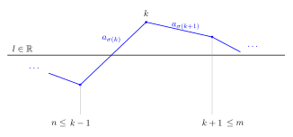
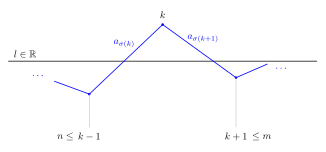

<!-- snippets: latex_math -->
# Chapter 5 Notes

Note exercise 5.19 gives us key results and notation:

$$
\begin{align*}
a_j^{+} & \coloneqq
\begin{cases}
a_j & \text{ if } a_j >0 \\
0 & \text{ if } a_j \leq 0
\end{cases}
,
& a_j^{-} & \coloneqq
\begin{cases}
- a_j & \text{ if } a_j < 0 \\
0 & \text{ if } a_j \geq 0
\end{cases}
\end{align*}
$$

Let

$$
\begin{align*}
S_n & \coloneqq \sum_{j=1}^{n} a_j,
& \lvert S \rvert_n & \coloneqq \sum_{j=1}^{n} \lvert a_j \rvert \\
S_{n}^{+} & \coloneqq \sum_{j=1}^{n} a_{j}^{+},
& S_{n}^{-} & \coloneqq \sum_{j=1}^{n} a_{j}^{-} \\
\end{align*}
$$

Therefore

$$
\begin{align*}
\lvert a_j \rvert &= a_j^{+} + a_{j}^{-} \\
a_{j} &= a_{j}^{+} + a_{j}^{-}
\end{align*}
\implies
\begin{align*}
\lvert S \rvert_{n} &= S_{n}^{+} + S_{n}^{-} \\
S_{n} &= S_{n}^{+} - S_{n}^{-}
\end{align*}
$$

In 5.19 we showed that if $\sum_{j=1}^{\infty} a_j$ is convergent but not absolutely convergent then both $\sum_{j=1}^{\infty} a_{j}^{+}$ and $\sum_{j=1}^{\infty} a_{j}^{-}$ diverge.

In other words.

$S_n$ converges and $\lvert S \rvert_{n}$ not converging implies that both $S_{n}^{+}$ and $S_{n}^{-}$ do not converge.

## Exercise 5.21

Suppose that $\sum_{j=1}^{\infty} a_{j}$ is convergent but not absolutely convergent. 

Let $l \in \mathbb{R}$ and,

$$
\begin{align*}
S(0) &= \left\{ n \in \mathbb{N} : a_n < 0 \right\}, &
T(0) &= \left\{ n \in \mathbb{N} : a_n \geq 0 \right\}
\end{align*}
$$

We then inductively define $\sigma : \mathbb{N} \to \mathbb{N}$ for each $n \in \mathbb{N}$,

let $\tilde{S}_{n} \coloneqq \sum_{j=1}^{n} a_{\sigma(j)}$ , $\tilde{S}_{\infty} \coloneqq \lim_{n \to \infty} \tilde{S}_{n}$
and $\tilde{S}_{0} \coloneqq 0$,

$$
\begin{align*}
\text{ if } \tilde{S}_{n-1} < l
\\
\sigma \left( n \right) & \coloneqq \min T \left( n-1 \right),
& T(n) & \coloneqq T(n-1) \setminus \left\{ \sigma(n) \right\},
& S(n) & \coloneqq S(n-1)
\\
\text{ if } \tilde{S}_{n-1} \geq l
\\
\sigma \left( n \right) & \coloneqq \min S \left( n-1 \right),
& T(n) & \coloneqq T(n-1),
& S(n) & \coloneqq S(n-1) \setminus \left\{ \sigma(n) \right\}
\end{align*}
$$

In other words if the sum is above $l$ pick the next negative term and vice versa.

### [ii] $\sigma$ is a permutation

#### Solution

Because neither $S_{n}^{+}$ or $S_{n}^{-}$ converge there are infinitely many terms such that $a_{j}^{+}$ and $a_{j}^{-}$ are non zero. Therefore both $S(0), T(0)$ are infinite and the construction is able to pick $\sigma(n)$ at each stage.

### [iii]

Let $n \in \mathbb{N}$, if, 

- $\kappa > |a_r|$ for all $r \in S(n) \cup T(n)$
- $m > n$ and $S(m) \neq S(n)$, $T(m) \neq T(n)$

show that $|\sum_{j=1}^{m} a_{\sigma(j)} - l| < \kappa$. 

(It may be helpful to consider what happens when $\sum_{j=1}^{m} a_{\sigma(j)} - l$ changes sign.)

#### Solution

$S(m) \neq S(n)$, $T(m) \neq T(n)$ 

$\iff$

there exists $k$ such that $n<k<m$ and $a_{\sigma(k)}, a_{\sigma(k+1)}$ have different sign.

Let $k$ be the greatest interger less than $m$ where this occurs.

Assume that $\hat{S}_k \geq l$. The $<l$ case is a very similar proof.

Therefore by sign change $\hat{S}_{k-1} < l$

Notice that 

$S(n) \cup T(n) = \mathbb{N} \setminus \left\{ \sigma(1), \dots \sigma(n) \right\} = \left\{ \sigma(n+1), \sigma(n+2), \dots \right\}$

There are then two sub cases to consider:

##### Case 1
$\hat{S}_{k+1} > l$

$\hat{S}_{k-1} < l$

$\implies   \hat{S}_{k-1} + a_{\sigma(k)} < l + a_{\sigma(k)} \implies \hat{S}_{k} - l < a_{\sigma(k)}$

So $0 \leq S_{k} -l < a_{\sigma(k)}$

Because $k$ is the last integer $<m$ where $a_{\sigma(k)}, a_{\sigma(k+1)}$ have different signs, it holds that $a_{\sigma(j)} > 0$ for all $j \in \left\{ k+1, \dots, m \right\}$

##### Case 2
$\hat{S}_{k+1} \leq l$

