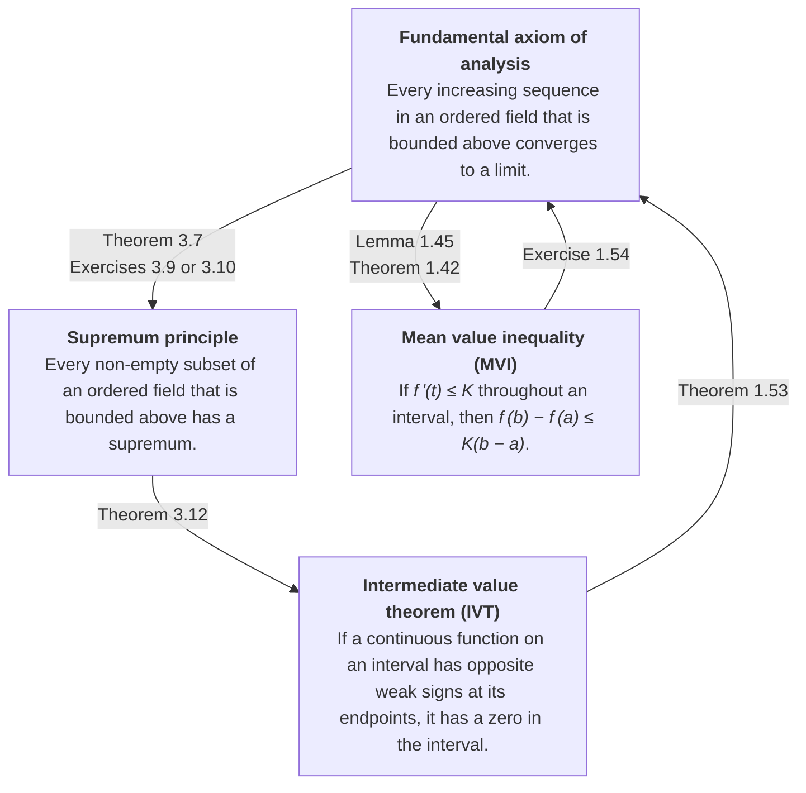
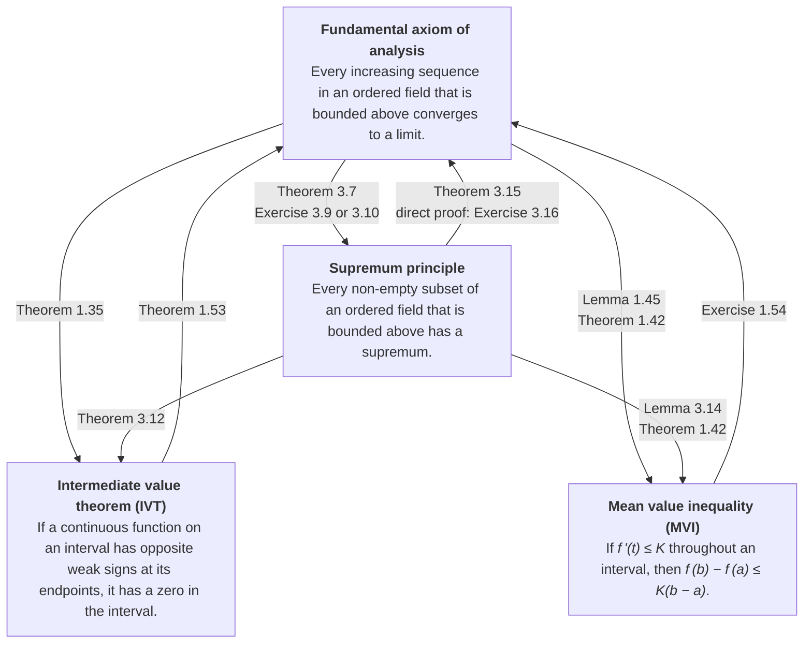

# Chapters 1-3

## Mermaid

### Minimal

### Full

## TikZ

Both variants use one ELK Layered layout of the complete graph. The minimal
graph is therefore the full graph with its additional arrows omitted: node,
route, label, and canvas geometry are identical.

### Minimal

{ .theorem-dependency-graph loading=lazy }

### Full

{ .theorem-dependency-graph loading=lazy }
